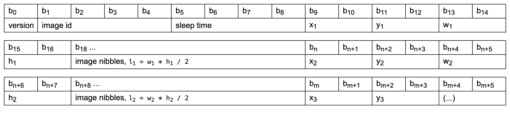

# Schema Definition

The server output is encoded as a stream of bytes, with the following headers:

* version: First byte which always describe the schema version. The schema discussed in here has version `0x01`
* image id: A 32bit integer that identifies the current image displayed. This id is stored on the device and will be send to the server when a new request is send. The server should be able to identifiy what is currently displayed on the device by using the version
* sleep time: A 32 bit integer which describes how many seconds the device should sleep before querying the server again.
* x: X position to render the image. If the full display should be drawn, x is set to `0x0000`
* y: Y position to render the image. If the full display should be drawn, y is set to `0x0000`
* w: width of the image. If the full display should be drawn, width is set to `0x03CO` (960)
* h: height of the image. If the full display should be drawn, height is set to `0x021C` (540)
* image nibbles: The actual image data. The display is able to draw 16 different gray levels, therefore each pixel is encoded by a nibble (4 bits).
Therefore the expected length of the data stream is `l = w * b / 2`.
The last 4 bits of a byte represent the first pixel. The image is encoded left to right, then top to bottom. This means that two directly consecutive pixels in the x-axis also follow each other directly in the byte stream. The value `0xFF` represents white, `0x00` black.

All integers are encoded in little endian format.

A single message can contain multiple images if the message continues after the end of the datastream, i.e. after `18 + l` bytes. Then, further x, y, w, h and data streams can be send using the same encoding.

It's also possible to send no image data at all - the message would end after 8 bytes. In this case no image is drawn and the device goes back to sleep.

For a better understanding you can look at the [Python Tools](../tools/) which provide a very simple implementation of the schema.